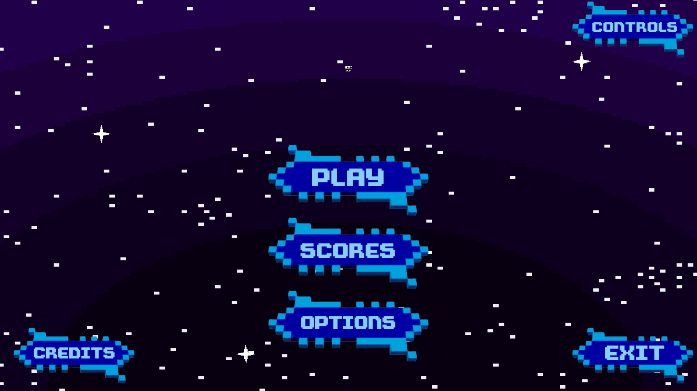
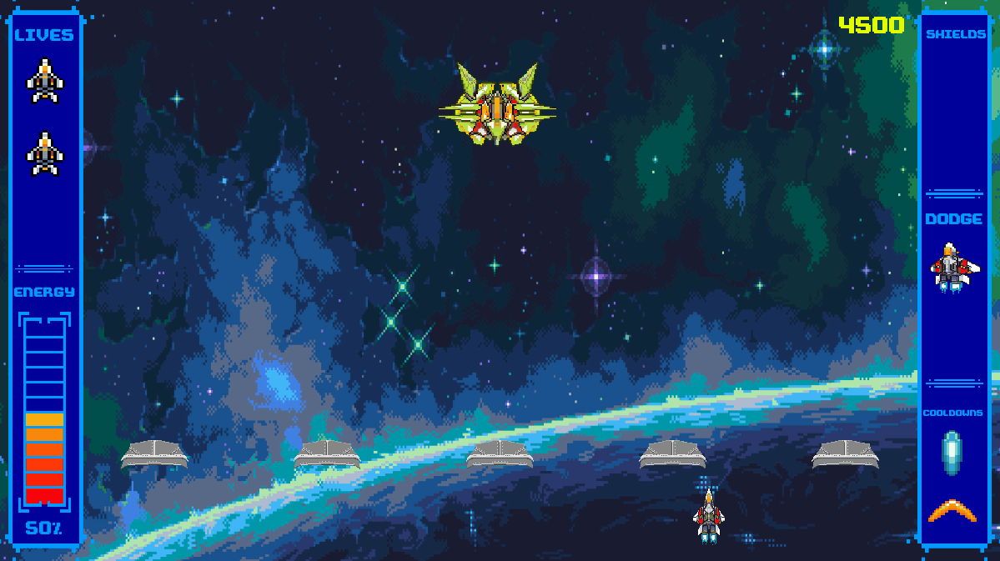
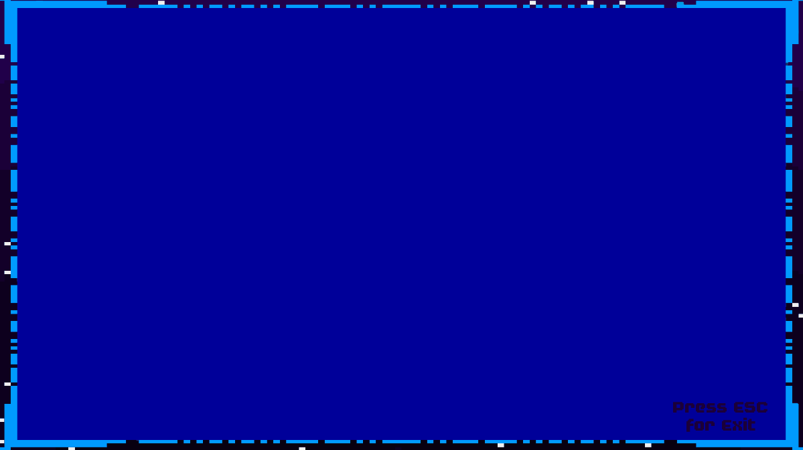

# Space_Saviors :space_invader:

Available to play NOW at: https://cristinaruizcode.itch.io/space-savior

:bangbang:INFORMATIVE NOTE:bangbang:

This is the first game I have created, which means that the code in it is not entirely optimal and does not reflect my current programming skills and knowledge.
 

:rocket:DESCRIPTION:rocket:

Choose a ship and defend yourself from the attack of aliens!!!

You can choose between 5 ships, each with its own improvements, and 3 different difficulties to test your skills.

With the help of the boomerang shot, the dodge and your shields you must resist to face the enemy base ship.

:sparkles:CREDITS:sparkles:

 
